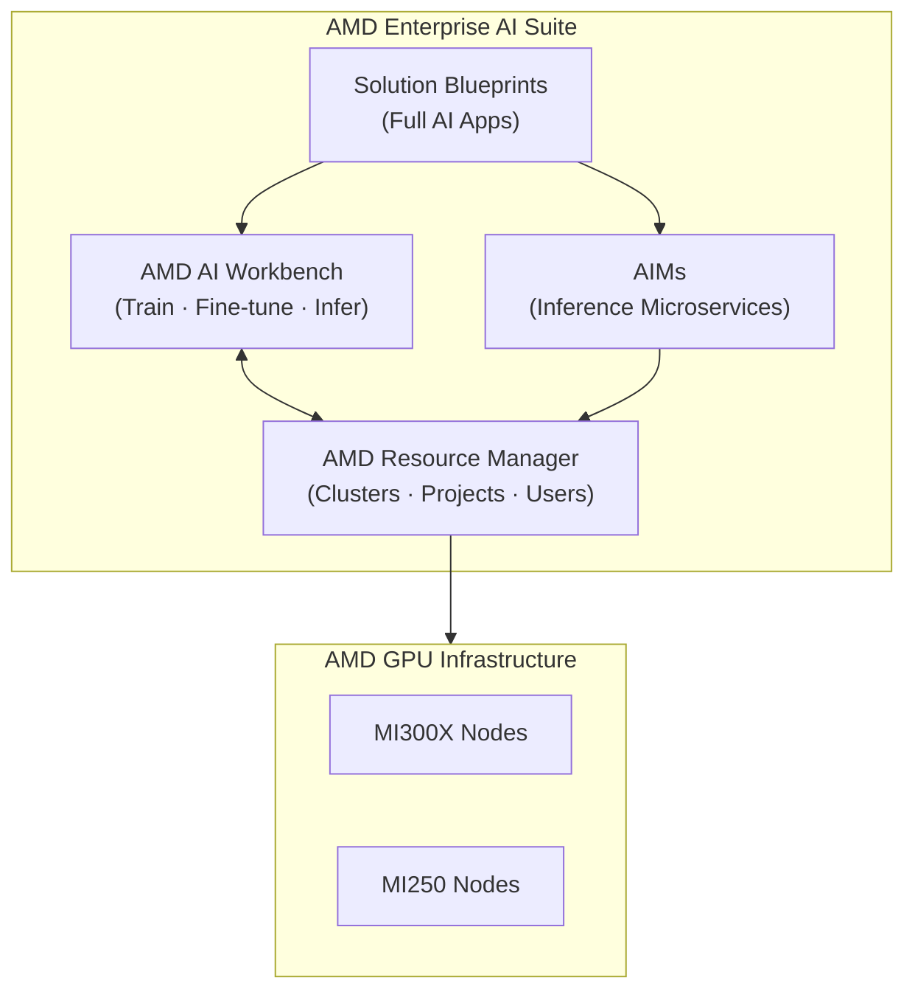

# Platform Overview

## What Is AMD Enterprise AI Suite?

AMD Enterprise AI Suite is an **enterprise-grade AI platform** built to run on AMD GPU hardware. It provides the full stack needed to go from raw compute to production AI applications — without stitching together dozens of individual tools.

---

## Architecture

---

## Components at a Glance

### AMD AI Workbench
The **primary interface for AI practitioners**. Use it to:

- Browse and download models from the Model Catalog
- Launch training and fine-tuning jobs
- Deploy models for inference
- Access JupyterLab and other dev workspaces
- Track experiments with MLflow

### AMD Resource Manager
The **control plane for infrastructure administrators**. Use it to:

- Connect and monitor AMD GPU clusters
- Create projects and assign compute quotas
- Manage users and access control (SSO or manual)
- Configure storage buckets and secrets
- Monitor real-time resource utilization

### AMD Inference Microservices (AIMs)
**Pre-built, optimized model servers** for production deployment. AIMs are:

- Available via Kubernetes, KServe, or Docker
- Pre-configured for AMD GPU hardware
- Deployable in minutes using the AIMs Catalog

### Solution Blueprints
**End-to-end AI applications** you can deploy as a whole. Examples include chat UIs, benchmarking pipelines, image generation services, and weather forecasting models.

---

## Deployment Options

The suite can be deployed in two ways:

| Option | Best For |
|---|---|
| **On-premises** | Full control, air-gapped environments, data privacy requirements |
| **DigitalOcean Cloud** | Quick evaluation, teams without on-prem hardware |

### On-premises Setup Tools

For bare metal on-premises installations, two open-source tools by Silogen handle the heavy lifting:

| Tool | Role |
|---|---|
| [**ClusterBloom**](../infrastructure/cluster-bloom.md) | Provisions the RKE2 Kubernetes cluster, sets up ROCm for AMD GPUs, configures storage |
| [**ClusterForge**](../infrastructure/cluster-forge.md) | Deploys all AMD Enterprise AI Suite services into the cluster via GitOps (ArgoCD) |

These run in sequence — ClusterBloom first, then ClusterForge — and together produce a fully configured platform from bare metal in a single workflow.

[Infrastructure Setup Guide →](../infrastructure/overview.md)

---

## Key Differentiators

- **AMD-optimized**: Tuned for MI300X, MI250, and other AMD Instinct GPUs
- **Open inference engines**: Ships with vLLM, SGLang, and llama.cpp — battle-tested open-source runtimes
- **Full MLOps stack**: Training, evaluation, serving, and monitoring in one platform
- **Enterprise-ready**: SSO, RBAC, secrets management, project-level quotas

---

## Official References

-  [Official Platform Overview](https://enterprise-ai.docs.amd.com/en/latest/platform-overview.html)
- [AMD Enterprise AI GitHub](https://github.com/amd-enterprise-ai)
