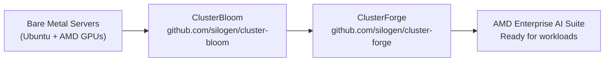

# Infrastructure Setup Overview

Before you can use AMD Enterprise AI Suite, you need a properly configured Kubernetes cluster with AMD GPU support. This section covers the two open-source tools that handle this for you.

---

## The Two-Tool Setup Process

Setting up AMD Enterprise AI Suite on bare metal uses two tools that work in sequence:



### ClusterBloom — Provision the Cluster
ClusterBloom is a tool for deploying and configuring Kubernetes clusters using RKE2, with specialized support for AMD GPU environments. It automates multi-node cluster setup, ROCm configuration, storage with Longhorn, and ClusterForge integration.

**In short:** turns raw Ubuntu servers into a working RKE2 Kubernetes cluster with AMD GPUs ready.

[Full ClusterBloom Guide →](cluster-bloom.md)

### ClusterForge — Install the Platform
ClusterForge is designed to bundle various third-party, community, and in-house components into a single, streamlined stack that can be deployed in Kubernetes clusters. It is the direct installer for AMD Enterprise AI Suite.

**In short:** takes a bare Kubernetes cluster and installs every service AMD Enterprise AI Suite needs — monitoring, storage, identity, GPU operators, ML scheduling, and more.

[Full ClusterForge Guide →](cluster-forge.md)

---

## What Gets Set Up

After running both tools, your cluster will have:

| Layer | Provided By | Examples |
|---|---|---|
| Kubernetes (RKE2) | ClusterBloom | Control plane, worker nodes |
| AMD GPU drivers | ClusterBloom | ROCm setup |
| Storage | ClusterBloom + ClusterForge | Longhorn, MinIO (S3) |
| Networking | ClusterForge | MetalLB, Gateway API |
| Monitoring | ClusterForge | Grafana, Prometheus, Loki |
| Identity / SSO | ClusterForge | KeyCloak |
| GPU scheduling | ClusterForge | AMD GPU Operator, Kueue |
| ML platform | ClusterForge | AMD AI Workbench, Resource Manager |

---

## Prerequisites Checklist

Before starting, confirm:

- [ ] Ubuntu servers (version checked at runtime by ClusterBloom)
- [ ] Root/sudo access on all nodes
- [ ] 500 GB+ disk for root partition, 2 TB+ for workloads
- [ ] NVMe drives recommended for storage
- [ ] ROCm-compatible AMD GPUs on GPU nodes
- [ ] A domain name configured and pointing to your cluster's IP

---

## Step-by-Step Summary

```bash
# 1. On your first node — provision the cluster
sudo ./bloom --config bloom.yaml

# 2. On each additional node — join the cluster
# (use the command generated in additional_node_command.txt)

# 3. ClusterForge runs automatically as part of ClusterBloom
# Or run it manually on an existing cluster:
./scripts/bootstrap.sh your-domain.com
```

That's it. After these steps, your AMD Enterprise AI Suite is ready.

---

## Cloud Alternative

If you don't have bare metal servers, use the **DigitalOcean cloud installation** path instead:

[DigitalOcean Cloud Installation](https://enterprise-ai.docs.amd.com/en/latest/platform-infrastructure/digitalocean-installation.html)
