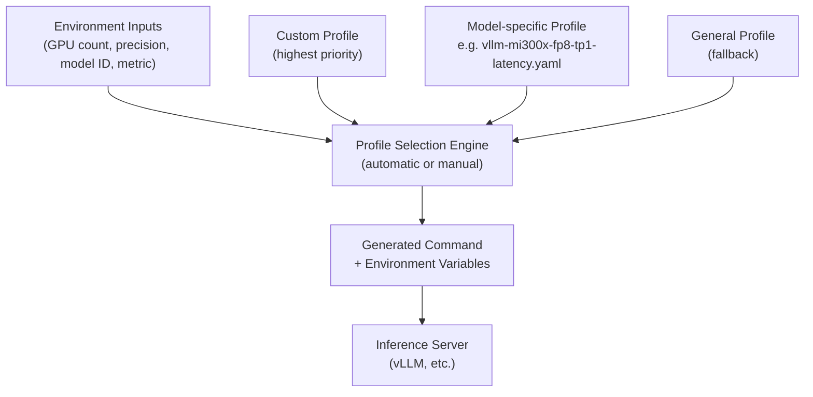

# Aim-Build

[github.com/amd-enterprise-ai/aim-build](https://github.com/amd-enterprise-ai/aim-build) · Python · MIT License

---

## What Is It?

`aim-build` contains the tools and profiles to **build AMD Inference Microservice (AIM) containers**. It is the build-time counterpart to `aim-engine` — it defines the profile system, packages inference logic, and produces the Docker images that are deployed as AIMs.

---

## How the Profile System Works

The core of AIM is a **profile-driven system**. Rather than hardcoding inference parameters, AIM uses YAML profiles that define the optimal configuration for a given model, GPU, precision, and workload type.



### Profile Selection Priority

1. **Custom profiles** (`/workspace/aim-runtime/profiles/custom/`) — highest priority
2. **Model-specific profiles** (`profiles/{org}/{model}/`)
3. **General profiles** (`profiles/general/`) — fallback

### Profile Selection Parameters

Profiles are automatically chosen based on:

| Parameter | Example Values |
|---|---|
| Model ID | `meta-llama/Llama-3.1-8B-Instruct` |
| Precision | `fp16`, `bf16`, `fp8`, `int4`, `int8`, `auto` |
| Engine | `vllm` |
| Metric | `latency`, `throughput` |
| GPU count | `1`, `2`, `4`, `8`, `auto` |
| GPU architecture | `MI300X`, `MI325X`, `MI350X`, `MI355X` |

---

## Container Build Patterns

AIM uses a **two-tier container approach**:

| Container | Description | Model Download |
|---|---|---|
| `aim-base` | Universal image — runs any supported model | At runtime |
| `aim` (model-specific) | Extended image with optimized profiles pre-baked for one model | At runtime or pre-cached |

### Build Commands

```bash
# Build the universal base container
make build-base

# Build a model-specific container
make build-model ORG=meta-llama MODEL=Llama-3.1-8B-Instruct
```

---

## Key Environment Variables

### Required (base container only)
| Variable | Description |
|---|---|
| `AIM_MODEL_ID` | Hugging Face model ID (e.g. `meta-llama/Llama-3.1-8B-Instruct`) or S3 path |

### Common Optional Variables
| Variable | Description | Default |
|---|---|---|
| `HF_TOKEN` | Hugging Face token for gated models | — |
| `AIM_PRECISION` | Precision format | `auto` |
| `AIM_GPU_COUNT` | Number of GPUs | `auto` |
| `AIM_GPU_MODEL` | Override GPU detection (e.g. `MI300X`) | auto-detected |
| `AIM_ENGINE` | Inference engine | `vllm` |
| `AIM_METRIC` | Optimization target | `latency` |
| `AIM_PROFILE_ID` | Force a specific profile (bypasses auto-selection) | — |
| `AIM_PORT` | API port | `8000` |
| `AIM_ENGINE_ARGS` | Override engine args as JSON | — |
| `AIM_CACHE_PATH` | Model cache directory | `/workspace/model-cache` |

### S3 / MinIO Variables
| Variable | Description |
|---|---|
| `AWS_ACCESS_KEY_ID` | S3 access key |
| `AWS_SECRET_ACCESS_KEY` | S3 secret key |
| `AWS_ENDPOINT_URL` | Custom endpoint (for MinIO/Ceph) |

---

## Running an AIM Container

### Basic (Hugging Face model)

```bash
docker run \
  -e AIM_MODEL_ID=meta-llama/Llama-3.1-8B-Instruct \
  -e HF_TOKEN=your_token \
  --device=/dev/kfd --device=/dev/dri \
  -p 8000:8000 \
  aim-base:0.9
```

### From MinIO / S3

```bash
docker run \
  -e AIM_MODEL_ID=s3://models/meta-llama/Llama-3.1-8B-Instruct \
  -e AWS_ACCESS_KEY_ID=minioadmin \
  -e AWS_SECRET_ACCESS_KEY=minioadmin \
  -e AWS_ENDPOINT_URL=https://minio.example.com:9000 \
  --device=/dev/kfd --device=/dev/dri \
  -p 8000:8000 \
  aim-base:0.9
```

### With Engine Args Override

```bash
docker run \
  -e AIM_MODEL_ID=meta-llama/Llama-3.1-8B-Instruct \
  -e AIM_ENGINE_ARGS='{"max-model-len": 8192, "gpu-memory-utilization": 0.85}' \
  --device=/dev/kfd --device=/dev/dri \
  -p 8000:8000 \
  aim-base:0.9
```

---

## AIM Runtime CLI

The container exposes a CLI with these subcommands:

| Command | Description |
|---|---|
| `serve` | Default — selects profile and starts the inference server |
| `dry-run` | Shows which profile would be selected, without starting the server |
| `list-profiles` | Lists all profiles and their compatibility with current config |
| `download-to-cache` | Pre-downloads a model to local cache before serving |

### dry-run Example

```bash
docker run \
  -e AIM_MODEL_ID=meta-llama/Llama-3.1-8B-Instruct \
  -e AIM_GPU_COUNT=1 \
  -e AIM_PRECISION=fp16 \
  aim-base:0.9 \
  dry-run
```

Use `--format json` for CI/CD pipeline integration.

### Pre-download then Serve (Two-Step)

```bash
# Step 1: Download
docker run --rm \
  -e AIM_MODEL_ID=meta-llama/Llama-3.1-8B-Instruct \
  -e HF_TOKEN=your_token \
  -v /host/model-cache:/workspace/model-cache \
  aim-base:0.9 download-to-cache

# Step 2: Serve (uses cached model, no download)
docker run \
  -e AIM_MODEL_ID=meta-llama/Llama-3.1-8B-Instruct \
  -v /host/model-cache:/workspace/model-cache \
  --device=/dev/kfd --device=/dev/dri \
  -p 8000:8000 \
  aim-base:0.9
```

---

## Custom Profiles

Mount a directory of custom YAML profiles to override built-in configurations:

```bash
docker run \
  -e AIM_MODEL_ID=meta-llama/Llama-3.1-8B-Instruct \
  -v /host/custom-profiles:/workspace/aim-runtime/profiles/custom \
  --device=/dev/kfd --device=/dev/dri \
  -p 8000:8000 \
  aim-base:0.9
```

**Example custom profile YAML:**

```yaml
metadata:
  engine: vllm
  gpu: MI300X
  precision: fp8
  gpu_count: 1
  metric: latency
  manual_selection_only: false
  type: optimized

engine_args:
  gpu-memory-utilization: 0.98
  dtype: float8
  tensor-parallel-size: 1
  max-model-len: 16384

env_vars:
  VLLM_FP8_PADDING: "1"
```

---

## Model Cache Formats

| Format | Path Pattern | When to Use |
|---|---|---|
| Local directory (default) | `{cache}/org/model/` | Fastest lookup, recommended |
| HuggingFace cache | `{cache}/hub/models--org--model/` | Use `--use-hf-cache` flag |

---

## Source & License

[github.com/amd-enterprise-ai/aim-build](https://github.com/amd-enterprise-ai/aim-build)
