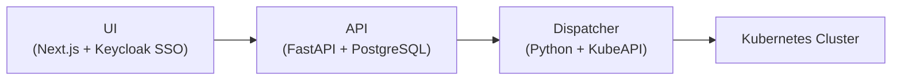

# amd-eai-suite

[github.com/amd-enterprise-ai/amd-eai-suite](https://github.com/amd-enterprise-ai/amd-eai-suite) · Python / TypeScript · MIT License

---

## What Is It?

This is the **core source code** for the AMD Enterprise AI Suite platform. It contains the main services and common Python packages that power the **AI Workbench** and **AI Resource Manager** — the two primary user-facing components of the suite.

!!! info
    AI Workbench and AI Resource Manager currently share an API and UI, both located together in `services/airm`.

---

## Architecture

The suite has three main components:



---

## Components

### API
The central backend layer, handling both **AI Resource Manager** and **AI Workbench** functionality:

- Organization, project, quota, and cluster coordination
- AIMs (AMD Inference Microservices) deployment
- Model fine-tuning and dataset management
- AI Workspaces management
- API key management for programmatic access
- Swagger UI exposed for API exploration
- OAuth2 authentication via Keycloak

**Tech stack:** FastAPI, PostgreSQL, Keycloak, RabbitMQ, MinIO

### UI
The frontend interface for both AI Workbench and Resource Manager:

- Cluster onboarding, resource allocation, and job monitoring
- Interactive chat and model comparison
- AI Workspace management
- Model catalog browsing
- Fine-tuning job configuration
- Built with Next.js and Keycloak-based SSO

**Tech stack:** Next.js, Hero UI, Keycloak SSO

### Dispatcher
A cluster-side agent that:

- Receives instructions from the API
- Interacts with Kubernetes via KubeAPI
- Manages workload lifecycle on the cluster
- Runs directly on Kubernetes clusters

**Tech stack:** Python, FastAPI

---

## Repository Structure

```
amd-eai-suite/
├── services/
│   └── airm/
│       ├── api/          ← FastAPI backend
│       ├── ui/           ← Next.js frontend
│       └── dispatcher/   ← Cluster-side agent
├── packages/             ← Shared Python packages
└── tooling/              ← Dev tooling
```

---

## Development Setup

### Prerequisites

- Python 3.13
- Node.js + `pnpm` (for frontend)
- `uv` (Python dependency manager)
- Docker & Docker Compose
- Pre-commit

!!! tip "Windows Users"
    Use [WSL](https://learn.microsoft.com/en-us/windows/wsl/install) for full compatibility.

### Setup

```bash
git clone https://github.com/amd-enterprise-ai/amd-eai-suite
cd amd-eai-suite

# Install pre-commit hooks (runs tests automatically on push)
uv tool run pre-commit install --install-hooks \
  --hook-type pre-commit \
  --hook-type pre-push
```

### Running Tests

```bash
# API tests
cd services/airm/api && uv run pytest

# UI tests
cd services/airm/ui && pnpm test

# Dispatcher tests
cd services/airm/dispatcher && uv run pytest
```

!!! note "Pre-push Hooks"
    Pre-push hooks automatically run tests with coverage for whichever component you've changed. Tests must pass before the push is accepted.

---

## Releases

Latest: **v0.3.0** (Dec 18, 2025)

[View all releases](https://github.com/amd-enterprise-ai/amd-eai-suite/releases)
