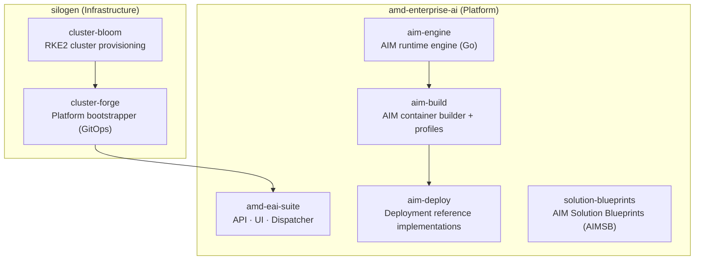

# GitHub Repositories Overview

The AMD Enterprise AI Suite is built from a collection of open-source repositories spread across two GitHub organizations. Understanding which repo does what will save you a lot of confusion.

---

## Two GitHub Organizations

| Organization | Purpose |
|---|---|
| [**amd-enterprise-ai**](https://github.com/amd-enterprise-ai) | Official AMD repos — platform source code, AIM containers, deployment manifests, solution blueprints |
| [**silogen**](https://github.com/silogen) | Infrastructure tools — Kubernetes cluster provisioning and platform bootstrapping |

---

## The Full Repo Map

---

## At a Glance

| Repo | Org | Language | What it does |
|---|---|---|---|
| [cluster-bloom](https://github.com/silogen/cluster-bloom) | silogen | Go | Provisions RKE2 Kubernetes cluster with AMD GPU / ROCm support |
| [cluster-forge](https://github.com/silogen/cluster-forge) | silogen | Shell/Helm | Deploys full AMD Enterprise AI Suite onto a Kubernetes cluster via ArgoCD |
| [amd-eai-suite](https://github.com/amd-enterprise-ai/amd-eai-suite) | amd-enterprise-ai | Python / TypeScript | Core platform — API, UI, and Dispatcher for AI Workbench + Resource Manager |
| [aim-build](https://github.com/amd-enterprise-ai/aim-build) | amd-enterprise-ai | Python | Builds AIM Docker containers and manages model profiles |
| [aim-deploy](https://github.com/amd-enterprise-ai/aim-deploy) | amd-enterprise-ai | Shell | Reference deployment manifests for Kubernetes and KServe |
| [aim-engine](https://github.com/amd-enterprise-ai/aim-engine) | amd-enterprise-ai | Go | AIM runtime engine |
| [solution-blueprints](https://github.com/amd-enterprise-ai/solution-blueprints) | amd-enterprise-ai | Python | AIM Solution Blueprints (AIMSB) — end-to-end application templates |

---

## Detailed Pages

- [amd-eai-suite](amd-eai-suite.md) — Core platform source code
- [aim-build](aim-build.md) — AIM container build system and profile engine
- [aim-deploy](aim-deploy.md) — Deployment reference implementations
- [aim-engine](aim-engine.md) — AIM runtime engine
- [solution-blueprints](solution-blueprints-repo.md) — Solution Blueprints source code
- [cluster-bloom](../infrastructure/cluster-bloom.md) — Kubernetes cluster provisioning
- [cluster-forge](../infrastructure/cluster-forge.md) — Platform deployment via GitOps
