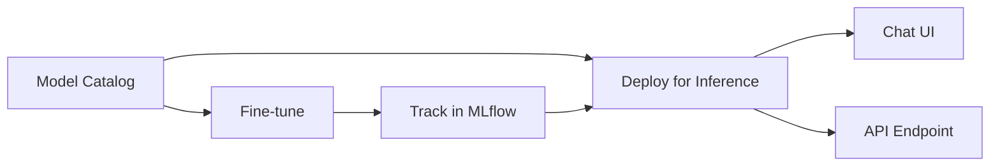

# AMD AI Workbench Overview

The **AMD AI Workbench** is the primary interface for AI practitioners. It's where you browse models, run experiments, fine-tune, and deploy AI models for inference.

---

## What Can You Do in the Workbench?

---

## Main Sections

| Section | Purpose |
|---|---|
| [Model Catalog](model-catalog.md) | Browse and download pre-trained models |
| [Training & Fine-tuning](training.md) | Customize models with your own data |
| [Inference](inference.md) | Deploy and interact with models |
| [Workspaces](workspaces.md) | JupyterLab and VS Code dev environments |
| [API Keys](api-keys.md) | Generate keys to call models programmatically |

---

## Typical Workflow

1. **Find a model** — browse the Model Catalog and pick one that fits your task
2. **Test it** — deploy it for inference and chat with it to evaluate quality
3. **Customize it** — if needed, fine-tune it on your data
4. **Track experiments** — use the integrated MLflow to compare fine-tuning runs
5. **Deploy it** — serve the final model as an API for your application

---

## Official Reference

 [AMD AI Workbench Docs](https://enterprise-ai.docs.amd.com/en/latest/workbench/overview.html)
